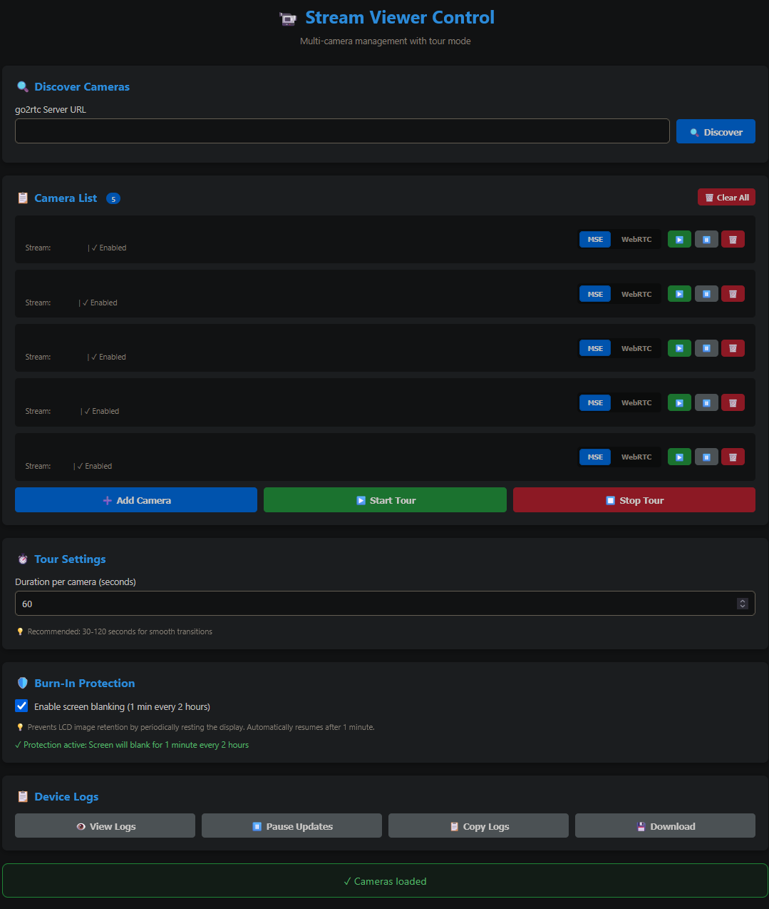

<p align="center">
  
</p>

# Android Stream Viewer

Turn your Android device into a network camera viewer with go2rtc integration and HTTP API for Home Assistant integration. The APK in Releases is generated by Github from the sourcecode in this repository.

> [!NOTE]
> I am *not* a programmer. This was developed with the help of AI. I needed an automation friendly way to show video streams from go2rtc on my Android TV based devices. Do not expect much if anything in the way of support or additional features. It is however trivial to fork the code and adjust it should it not fit your usecase. It is released here, as is, in the hopes that it will help or inspire others.

> [!CAUTION]
> This application has **NO built-in authentication or encryption**. Much like go2rtc itself the web server runs on port 9090 with **unrestricted access** to anyone who can reach the device on your network.
>
> ❌ **DO NOT** expose this app directly to the internet  
> ❌ **DO NOT** port forward 9090 to the internet  
> ❌ **DO NOT** use on untrusted networks (public WiFi, etc.)  
> ❌ **DO NOT** assume any built-in security exists

> [!IMPORTANT]
> ⚠️ Burn-In Prevention Disclaimer: While this app includes a burn-in prevention feature that periodically blanks the screen to reduce the risk of screen burn-in, this feature may not be sufficient for all devices and usage scenarios. OLED and certain LCD displays are particularly susceptible to burn-in from static images displayed for extended periods. Users are responsible for implementing their own mitigation strategies appropriate to their specific device and usage patterns. Best practice: Regularly change the displayed content by using tour mode, setting reasonable display timeouts, or scheduling automatic camera rotations. Static camera views displayed 24/7, even with blanking enabled, can still result in permanent screen damage over time. I assume no responsibility for screen burn-in or damage resulting from use of this application.

## Features

<p align="center">
  
</p>

- Automatically indexes cameras from specified go2rtc server
- WebRTC & MSE protocol support
- Camera tour mode (cycle through enabled cameras)
- Burn-in protection (for displays)
- Web configuration interface
- Home Assistant integration via API
- Dynamic camera list API endpoint
- **Intent-based camera launching** - Launch specific cameras directly via Android intents from Home Assistant or other apps
- Persistent go2rtc server configuration

## API Endpoints

### Camera Management
- `GET /api/cameras` - Get all cameras (full JSON)
- `GET /api/camera-names` - Get camera names as comma-separated list
- `POST /api/cameras` - Save cameras
- `POST /api/camera/{id}/toggle` - Toggle camera enabled/disabled

### Streaming
- `POST /api/config` - Configure stream
- `GET /api/status` - Get current stream status

### Tour
- `POST /api/tour/start` - Start camera tour
- `POST /api/tour/stop` - Stop camera tour
- `GET /api/tour/status` - Get tour status

### Configuration
- `POST /api/discover` - Discover cameras from go2rtc
- `POST /api/save-server-url` - Save go2rtc server URL
- `POST /api/default` - Set default camera
- `GET /api/default` - Get default camera

### System
- `GET /api/logs` - Get server logs
- `GET /api/burn-in/status` - Get burn-in protection status
- `POST /api/burn-in/toggle` - Toggle burn-in protection

## Intent Support

The app supports launching with specific cameras via Android intents. This enables direct camera selection from Home Assistant, automation tools, or other Android apps.

### Intent Format
```
Action: android.intent.action.MAIN
Package: com.tpn.streamviewer
Extra: camera_name (String) - The camera name to load
```

### Example ADB Command

```bash
adb shell am start -n com.tpn.streamviewer/.MainActivity --es camera_name "FRONTDOOR"
```

See the Home Assistant integration guide for automation examples.

## Home Assistant Integration

See `home-assistant/README.md` for complete setup instructions including intent-based automation examples.

## Installation

1. Download the APK from Releases
2. Enable "Install from Unknown Sources" on your Android device
3. Install APK via ADB, file manager, or browser
4. Configure go2rtc server URL in web interface

(Or build from source)
## Compatible Devices

Tested on Amazon Echo Show 5 & Chromecast with Google TV 4K

Some devices may struggle with WebRTC. In which case use a lower bitrate/framerate/resolution or switch to MSE.

## Building from Source

```bash
./gradlew assembleRelease
```

## Credits

Developed with AI assistance. Uses go2rtc for stream handling and NanoHTTPD for the embedded web server.
