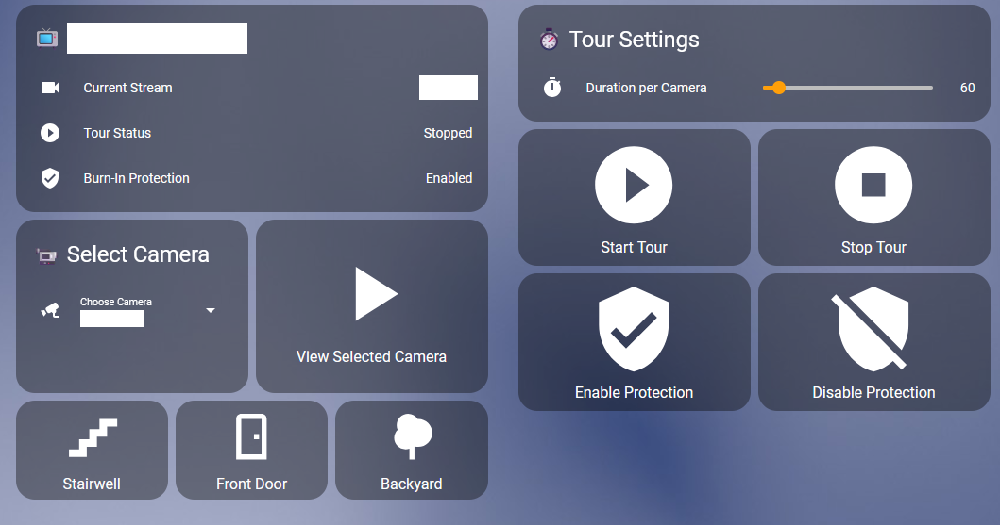

# Home Assistant Integration

Home Assistant integration for Android Stream Viewer.

<p align="center">
  
</p>


## Table of Contents
- [Setup](#setup)
- [Features](#features)
- [Sensors](#sensors)
- [Scripts](#scripts)
- [Automations](#automations)
- [Dashboard Examples](#dashboard-examples)
- [Troubleshooting](#troubleshooting)

## Setup

### Prerequisites
- Android Stream Viewer app installed and running
- go2rtc server configured
- Home Assistant with REST integration enabled

### 1. Add REST Sensors (rest.yaml)

Replace `<DEVICE_IP>` with your Android device's IP address (e.g., 192.168.1.100).

```yaml
# Camera names (dynamic list)
- resource: http://<DEVICE_IP>:9090/api/camera-names
  scan_interval: 60
  sensor:
    - name: "Stream Viewer Camera Names"
      unique_id: stream_viewer_camera_names
      value_template: "{{ value }}"

# Full camera data (JSON with IDs, protocols, order, etc.)
- resource: http://<DEVICE_IP>:9090/api/cameras
  scan_interval: 120
  sensor:
    - name: "Stream Viewer Camera List"
      unique_id: stream_viewer_camera_list
      value_template: "{{ value_json | length }}"
      json_attributes_path: "$"

# Current playback status
- resource: http://<DEVICE_IP>:9090/api/status
  scan_interval: 10
  sensor:
    - name: "Stream Viewer Status"
      unique_id: stream_viewer_status
      value_template: >
        {{ 'Playing' if value_json.playing else 'Idle' }}
      json_attributes:
        - playing
        - streamName
        - protocol
        - tourActive
        - go2rtcUrl
        - defaultStream

# Tour status
- resource: http://<DEVICE_IP>:9090/api/tour/status
  scan_interval: 30
  sensor:
    - name: "Stream Viewer Tour Status"
      unique_id: stream_viewer_tour_status
      value_template: >
        {{ 'Active' if value_json.active else 'Stopped' }}
      json_attributes:
        - active
        - cameraCount
        - currentStream

# Burn-in protection status
- resource: http://<DEVICE_IP>:9090/api/burn-in/status
  scan_interval: 300
  sensor:
    - name: "Stream Viewer Burn-In Protection"
      unique_id: stream_viewer_burn_in
      value_template: >
        {{ 'Enabled' if value_json.enabled else 'Disabled' }}
      json_attributes:
        - enabled
        - interval
        - duration

# Server logs (optional - for debugging)
- resource: http://<DEVICE_IP>:9090/api/logs
  scan_interval: 60
  sensor:
    - name: "Stream Viewer Logs"
      unique_id: stream_viewer_logs
      value_template: "{{ value.split('\\n') | length }} lines"
```

### 2. Add Input Select (input_select.yaml)

```yaml
stream_viewer_camera:
  name: Camera Viewer
  options:
    - "Loading..."
  initial: "Loading..."
  icon: mdi:cctv
```

### 3. Add Automations (automations.yaml)

```yaml
# Auto-populate camera dropdown from API
- alias: "Stream Viewer: Populate Camera Dropdown"
  description: "Automatically populate camera list from device API"
  triggers:
    - platform: homeassistant
      event: start
    - platform: state
      entity_id: sensor.stream_viewer_camera_names
  conditions: []
  actions:
    - service: input_select.set_options
      target:
        entity_id: input_select.stream_viewer_camera
      data:
        options: >
          
          
            {{ names.split(',') }}
          
            ['Loading...']
          
  mode: single

# Example: Auto-play camera on doorbell press
- alias: "Stream Viewer: Show Front Door on Doorbell"
  description: "Show front door camera when doorbell is pressed"
  triggers:
    - platform: state
      entity_id: binary_sensor.front_door_button
      to: "on"
  actions:
    - service: script.stream_viewer_play_camera
      data:
        camera_name: "FRONTDOOR"
  mode: single

# Example: Return to default after 2 minutes
- alias: "Stream Viewer: Return to Default"
  description: "Return to default camera after doorbell event"
  triggers:
    - platform: state
      entity_id: sensor.stream_viewer_status
      to: "Playing"
      for:
        minutes: 2
  conditions:
    - condition: template
      value_template: >
        {{ state_attr('sensor.stream_viewer_status', 'streamName') !=
           state_attr('sensor.stream_viewer_status', 'defaultStream') }}
  actions:
    - service: script.stream_viewer_play_default
  mode: single
```

### 4. Add Scripts (scripts.yaml)

```yaml
# Play specific camera by name
stream_viewer_play_camera:
  alias: "Stream Viewer: Play Camera"
  description: "Play a specific camera stream"
  fields:
    camera_name:
      description: "Camera name to play"
      example: "FRONTDOOR"
    protocol:
      description: "Protocol (mse, webrtc, auto)"
      example: "mse"
      default: "mse"
  sequence:
    - service: rest_command.stream_viewer_play
      data:
        camera: "{{ camera_name }}"
        protocol: "{{ protocol }}"

# Play selected camera from dropdown
stream_viewer_play_selected:
  alias: "Stream Viewer: Play Selected Camera"
  sequence:
    - service: script.stream_viewer_play_camera
      data:
        camera_name: "{{ states('input_select.stream_viewer_camera') }}"

# Play default camera
stream_viewer_play_default:
  alias: "Stream Viewer: Play Default Camera"
  sequence:
    - service: rest_command.stream_viewer_play_default

# Stop current stream
stream_viewer_stop:
  alias: "Stream Viewer: Stop Stream"
  sequence:
    - service: rest_command.stream_viewer_stop

# Start camera tour
stream_viewer_start_tour:
  alias: "Stream Viewer: Start Tour"
  fields:
    duration:
      description: "Duration per camera in seconds"
      example: 10
      default: 10
  sequence:
    - service: rest_command.stream_viewer_tour_start
      data:
        duration: "{{ duration }}"

# Stop camera tour
stream_viewer_stop_tour:
  alias: "Stream Viewer: Stop Tour"
  sequence:
    - service: rest_command.stream_viewer_tour_stop

# Toggle specific camera on/off
stream_viewer_toggle_camera:
  alias: "Stream Viewer: Toggle Camera"
  fields:
    camera_id:
      description: "Camera ID to toggle"
      example: "1760549119136lrymuktx6"
  sequence:
    - service: rest_command.stream_viewer_toggle_camera
      data:
        camera_id: "{{ camera_id }}"

# Toggle burn-in protection
stream_viewer_toggle_burn_in:
  alias: "Stream Viewer: Toggle Burn-In Protection"
  fields:
    enabled:
      description: "Enable or disable"
      example: true
  sequence:
    - service: rest_command.stream_viewer_burn_in_toggle
      data:
        enabled: "{{ enabled }}"

# Set default camera
stream_viewer_set_default:
  alias: "Stream Viewer: Set Default Camera"
  fields:
    camera_name:
      description: "Camera name to set as default"
      example: "FRONTDOOR"
  sequence:
    - service: rest_command.stream_viewer_set_default
      data:
        camera: "{{ camera_name }}"
```

### 5. Add REST Commands (configuration.yaml)

Replace `<DEVICE_IP>` and `<GO2RTC_IP>` with your actual IP addresses.

```yaml
rest_command:
  # Play specific camera
  stream_viewer_play:
    url: "http://<DEVICE_IP>:9090/api/config"
    method: POST
    content_type: "application/json"
    payload: >
      {
        "go2rtcUrl": "http://<GO2RTC_IP>:1984",
        "streamName": "{{ camera }}",
        "protocol": "{{ protocol | default('mse') }}"
      }

  # Play default camera
  stream_viewer_play_default:
    url: "http://<DEVICE_IP>:9090/api/config"
    method: POST
    content_type: "application/json"
    payload: >
      {
        "go2rtcUrl": "http://<GO2RTC_IP>:1984",
        "streamName": "{{ state_attr('sensor.stream_viewer_status', 'defaultStream') }}",
        "protocol": "mse"
      }

  # Stop stream
  stream_viewer_stop:
    url: "http://<DEVICE_IP>:9090/api/tour/stop"
    method: POST

  # Start tour
  stream_viewer_tour_start:
    url: "http://<DEVICE_IP>:9090/api/tour/start"
    method: POST
    content_type: "application/json"
    payload: >
      {
        "duration": {{ duration | default(10) }}
      }

  # Stop tour
  stream_viewer_tour_stop:
    url: "http://<DEVICE_IP>:9090/api/tour/stop"
    method: POST

  # Toggle camera enabled/disabled
  stream_viewer_toggle_camera:
    url: "http://<DEVICE_IP>:9090/api/camera/{{ camera_id }}/toggle"
    method: POST

  # Set default camera
  stream_viewer_set_default:
    url: "http://<DEVICE_IP>:9090/api/default"
    method: POST
    content_type: "application/json"
    payload: >
      {
        "streamName": "{{ camera }}"
      }

  # Toggle burn-in protection
  stream_viewer_burn_in_toggle:
    url: "http://<DEVICE_IP>:9090/api/burn-in/toggle"
    method: POST
    content_type: "application/json"
    payload: >
      {
        "enabled": {{ enabled | lower }}
      }
```

## Dashboard Examples

### Basic Control Card

```yaml
type: vertical-stack
cards:
  - type: entities
    title: Camera Viewer Control
    entities:
      - entity: input_select.stream_viewer_camera
      - entity: sensor.stream_viewer_status
      - entity: sensor.stream_viewer_tour_status
      - entity: sensor.stream_viewer_burn_in_protection
  - type: horizontal-stack
    cards:
      - type: button
        name: Play Selected
        icon: mdi:play
        tap_action:
          action: call-service
          service: script.stream_viewer_play_selected
      - type: button
        name: Stop
        icon: mdi:stop
        tap_action:
          action: call-service
          service: script.stream_viewer_stop
```

### Advanced Control Panel

```yaml
type: vertical-stack
cards:
  - type: entities
    title: Stream Viewer
    entities:
      - entity: input_select.stream_viewer_camera
        name: Select Camera
      - entity: sensor.stream_viewer_status
        name: Current Status
        secondary_info: last-changed
      - type: attribute
        entity: sensor.stream_viewer_status
        attribute: streamName
        name: Playing Camera
      - entity: sensor.stream_viewer_tour_status
        name: Tour Mode
      - entity: sensor.stream_viewer_burn_in_protection
        name: Burn-In Protection
  - type: horizontal-stack
    cards:
      - type: button
        name: Play
        icon: mdi:play
        tap_action:
          action: call-service
          service: script.stream_viewer_play_selected
      - type: button
        name: Stop
        icon: mdi:stop
        tap_action:
          action: call-service
          service: script.stream_viewer_stop
      - type: button
        name: Default
        icon: mdi:home
        tap_action:
          action: call-service
          service: script.stream_viewer_play_default
  - type: horizontal-stack
    cards:
      - type: button
        name: Start Tour
        icon: mdi:camera-switch
        tap_action:
          action: call-service
          service: script.stream_viewer_start_tour
          data:
            duration: 10
      - type: button
        name: Stop Tour
        icon: mdi:stop-circle
        tap_action:
          action: call-service
          service: script.stream_viewer_stop_tour
```

### Quick Camera Buttons

```yaml
type: horizontal-stack
cards:
  - type: button
    name: Front Door
    icon: mdi:door
    tap_action:
      action: call-service
      service: script.stream_viewer_play_camera
      data:
        camera_name: "FRONTDOOR"
  - type: button
    name: Driveway
    icon: mdi:car
    tap_action:
      action: call-service
      service: script.stream_viewer_play_camera
      data:
        camera_name: "DRIVEWAY"
  - type: button
    name: Backyard
    icon: mdi:tree
    tap_action:
      action: call-service
      service: script.stream_viewer_play_camera
      data:
        camera_name: "BACKYARD"
```

## Features

### Implemented
- Dynamic camera list synchronization from device
- Real-time playback status monitoring
- Camera tour control with configurable duration
- Camera selection via dropdown or direct name
- Burn-in protection toggle
- Default camera configuration
- Remote camera enable/disable
- Server log access for debugging

### Use Cases
- Display front door camera on doorbell press
- Cycle through cameras on a schedule
- Quick access to specific cameras
- Return to default view after events
- Disable unused cameras
- Monitor currently displayed stream

## Troubleshooting

### Camera list not populating
1. Check sensor state: `sensor.stream_viewer_camera_names`
2. Verify endpoint: `http://<DEVICE_IP>:9090/api/camera-names`
3. Confirm automation is enabled
4. Verify sensor entity ID matches automation

### Cameras not playing
1. Confirm go2rtc server is running
2. Verify IP addresses in REST commands
3. Ensure camera stream names match exactly
4. View logs: `sensor.stream_viewer_logs`

### Tour not working
1. Ensure at least one camera is enabled
2. Check tour status: `sensor.stream_viewer_tour_status`
3. Verify tour duration is reasonable (>5 seconds)

### Connection errors
1. Confirm Android device is on same network
2. Check firewall rules allow port 9090
3. Verify app is running on Android device
4. Test endpoint with browser: `http://<DEVICE_IP>:9090`
